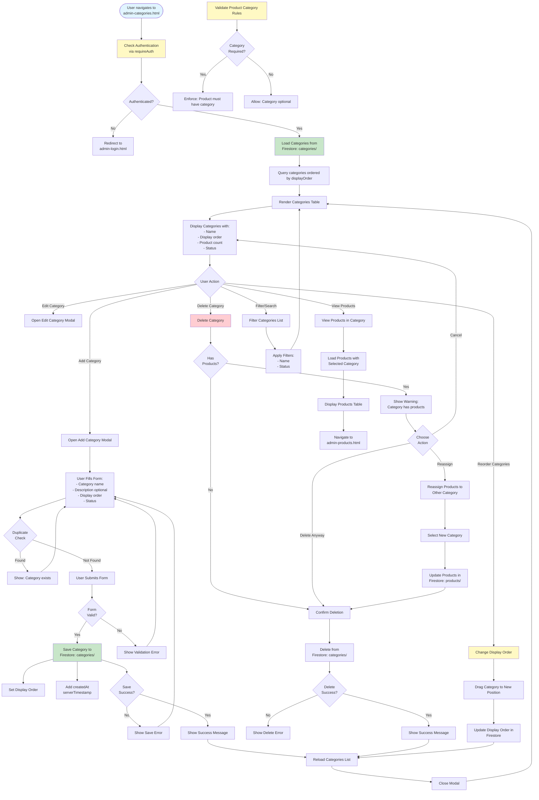

# Admin Categories Workflow

## Overview
Category management with sorting/display order, category mapping to products, and rules for product consistency.

## Status
🚧 **Planned - Coming Soon**

## Planned Workflow Diagram

## Planned Features

### Category Management
- **Category Creation**: Name, description, display order
- **Display Order**: Sort categories for display
- **Status**: Active, inactive
- **Duplicate Prevention**: Check for duplicate category names
- **Product Count**: Show number of products in category

### Category Rules
- **Product Consistency**: Rules for product category assignment
- **Required Categories**: Enforce category requirement for products
- **Category Validation**: Validate product categories

### Category Operations
- **Reorder**: Change display order
- **Delete**: Delete category with product reassignment option
- **Product View**: View all products in category

### Integration Points

#### Firestore Collections
- **`categories/{categoryId}`**: Category documents
  - Fields: `name`, `description`, `displayOrder`, `status`, `createdAt`, `updatedAt`
- **`products/{productId}`**: Product documents (category field)
  - Fields: `category` (references category)

#### Cross-Module Integration
- **Categories → Products**: Products assigned to categories
- **Products → Categories**: Category selection in product form
- **Categories → Shop**: Display categories on shop page

### Related Pages
- **admin-products.html**: Product category assignment
- **shop.html**: Category display and filtering

## Implementation Notes
- Display order management (drag-and-drop or manual entry)
- Product reassignment when deleting category
- Category validation rules
- Category-based product filtering
- Category hierarchy support (future enhancement)

