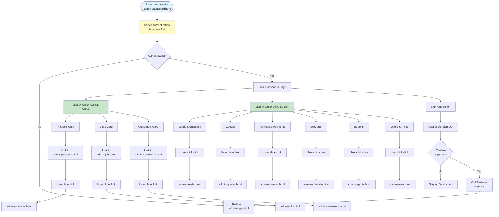

# Admin Dashboard Workflow

## Overview
Main entry point and navigation hub for the admin panel. Provides quick access to all admin sections.

## Status
✅ **Fully Implemented**

## Workflow Diagram

## Integration Points

### Firebase Services
- **Firebase Authentication**: `requireAuth()` check on page load
- **Firebase Auth**: Sign out functionality

### Navigation Structure
The dashboard provides access to all admin sections organized by category:

1. **Sales Pipeline**
   - Leads & Enquiries
   - Quotes
   - Invoices & Payments

2. **Production**
   - Jobs
   - Schedule
   - Time Tracking
   - QA / Checklists
   - Warranty / Aftercare

3. **Customers**
   - Customers
   - Vehicles

4. **Inventory & Purchasing**
   - Inventory
   - Products (Shop)
   - Categories
   - Suppliers
   - Purchase Orders

5. **Analytics**
   - Reports
   - Event Explorer
   - System Health

6. **Settings**
   - Users & Roles
   - Templates
   - Integrations
   - Audit Log

### Related Pages
- **admin-login.html**: Redirect destination if not authenticated
- All other admin pages: Accessible via navigation links

## Files
- `admin-dashboard.html`: Dashboard page with quick links and cards

