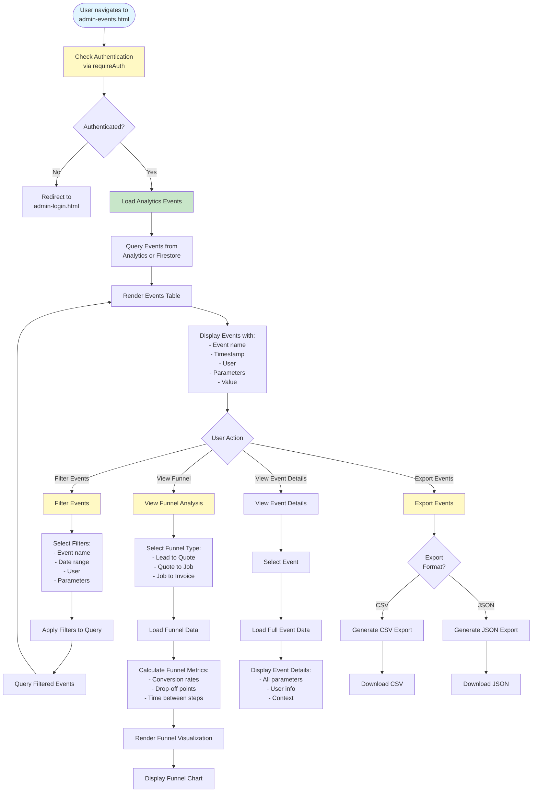

# Admin Event Explorer Workflow

## Overview
View analytics events with filtering by event name/date/user, funnel exploration, and export functionality.

## Status
🚧 **Planned - Coming Soon**

## Planned Workflow Diagram

## Planned Features

### Event Viewing
- **Event List**: View all analytics events
- **Event Filtering**: Filter by name, date, user, parameters
- **Event Details**: View full event data and context
- **Event Search**: Search events by parameters

### Funnel Exploration
- **Funnel Types**: Lead to Quote, Quote to Job, Job to Invoice
- **Conversion Rates**: Calculate conversion rates between steps
- **Drop-off Analysis**: Identify where users drop off
- **Time Analysis**: Time between funnel steps

### Export
- **CSV Export**: Export events as CSV
- **JSON Export**: Export events as JSON
- **Filtered Export**: Export filtered events only

### Integration Points

#### Analytics
- **Firebase Analytics**: Read events from Firebase Analytics
- **Custom Events**: Custom events stored in Firestore (optional)

#### Cross-Module Integration
- **All Modules → Events**: Events tracked from all modules
- **Events → Reports**: Event data for reporting

### Related Pages
- **admin-reports.html**: Use event data for reports
- **admin-dashboard.html**: Event summary on dashboard

## Implementation Notes
- Firebase Analytics integration (read events)
- Custom event storage in Firestore (optional)
- Funnel visualization (Chart.js, D3.js, etc.)
- Event filtering and search performance
- Export functionality

