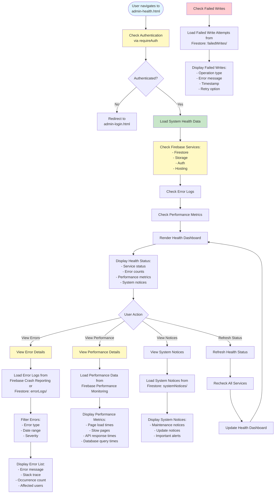

# Admin System Health Workflow

## Overview
System health monitoring with error monitoring links, slow page indicators, failed writes tracking, and system notices.

## Status
🚧 **Planned - Coming Soon**

## Planned Workflow Diagram

## Planned Features

### Health Monitoring
- **Service Status**: Check Firebase services status
- **Error Monitoring**: View error logs and counts
- **Performance Monitoring**: Track page load times, API response times
- **Failed Writes**: Track failed Firestore write attempts
- **System Notices**: Display system maintenance and update notices

### Error Tracking
- **Error Logs**: View error logs with details
- **Error Filtering**: Filter by type, date, severity
- **Error Analysis**: Analyze error patterns
- **Error Resolution**: Track error resolution

### Performance Tracking
- **Page Load Times**: Track page load performance
- **Slow Pages**: Identify slow-loading pages
- **API Performance**: Track API response times
- **Database Performance**: Track query performance

### Integration Points

#### Firebase Services
- **Firebase Crash Reporting**: Error monitoring
- **Firebase Performance Monitoring**: Performance tracking
- **Firestore**: Store error logs and system notices

#### Firestore Collections
- **`errorLogs/{logId}`**: Error log documents (optional)
- **`systemNotices/{noticeId}`**: System notice documents
- **`failedWrites/{writeId}`**: Failed write attempt documents (optional)

### Related Pages
- **admin-dashboard.html**: Health status summary
- **admin-audit.html**: Error logs in audit trail

## Implementation Notes
- Firebase Crash Reporting integration
- Firebase Performance Monitoring integration
- Real-time health status updates
- Error log aggregation and analysis
- Performance metric tracking
- System notice management

