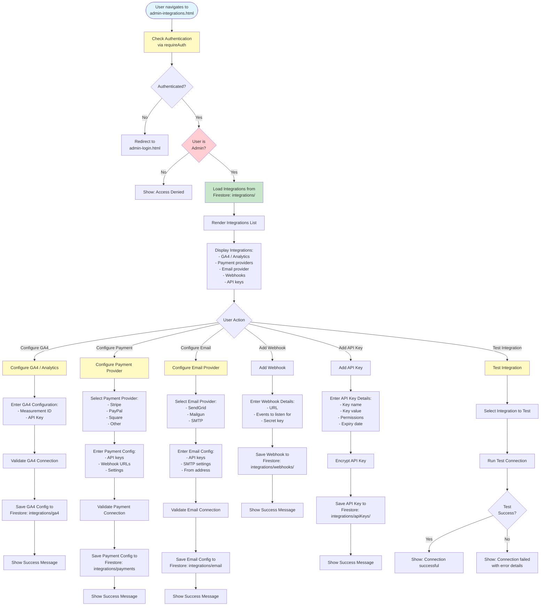

# Admin Integrations Workflow

## Overview
Integration management for GA4/Analytics setup, payment providers, email provider, webhooks, and API keys.

## Status
🚧 **Planned - Coming Soon**

## Planned Workflow Diagram

## Planned Features

### Integration Types
- **GA4 / Analytics**: Google Analytics 4 setup
- **Payment Providers**: Stripe, PayPal, Square, etc.
- **Email Provider**: SendGrid, Mailgun, SMTP
- **Webhooks**: Incoming and outgoing webhooks
- **API Keys**: API key management

### Integration Management
- **Configuration**: Configure each integration
- **Validation**: Test integration connections
- **Status Tracking**: Track integration status
- **Error Handling**: Handle integration errors
- **Security**: Encrypt sensitive credentials

### Integration Features
- **Webhook Management**: Add, edit, delete webhooks
- **API Key Management**: Generate, revoke API keys
- **Event Listening**: Configure events for webhooks
- **Test Connections**: Test integration connections

### Integration Points

#### Firestore Collections
- **`integrations/{integrationId}`**: Integration configuration documents
  - Fields: `type`, `name`, `config`, `status`, `lastTested`, `createdAt`, `updatedAt`
- **`integrations/webhooks/{webhookId}`**: Webhook documents
- **`integrations/apiKeys/{keyId}`**: API key documents (encrypted)

#### Cross-Module Integration
- **Integrations → All Modules**: Integrations used across all modules
- **Analytics → Events**: GA4 tracking
- **Payment → Invoices**: Payment processing
- **Email → Communications**: Email sending
- **Webhooks → External Systems**: External system integration

### Related Pages
- **admin-dashboard.html**: Integration status summary
- **All Admin Pages**: Use integrations (analytics, payments, email)

## Implementation Notes
- Secure credential storage (encryption)
- Integration testing functionality
- Webhook event handling (Cloud Functions)
- API key generation and rotation
- Integration status monitoring
- Error logging and alerting

