# Admin Invoices & Payments Workflow

## Overview
Invoice generation, payment tracking, deposits, milestones, and refund/credit note management.

## Status
🚧 **Planned - Coming Soon**

## Planned Workflow Diagram

```mermaid
flowchart TD
    Start([User navigates to<br/>admin-invoices.html]) --> AuthCheck[Check Authentication<br/>via requireAuth]
    AuthCheck --> AuthResult{Authenticated?}
    AuthResult -->|No| Redirect[Redirect to<br/>admin-login.html]
    AuthResult -->|Yes| LoadInvoices[Load Invoices from<br/>Firestore: invoices/]
    
    LoadInvoices --> Query[Query invoices with filters]
    Query --> RenderTable[Render Invoices Table]
    RenderTable --> DisplayInvoices[Display Invoices with:<br/>- Invoice number<br/>- Customer<br/>- Amount<br/>- Status sent/paid/overdue<br/>- Due date<br/>- Payment status]
    
    DisplayInvoices --> UserAction{User Action}
    
    UserAction -->|Create Invoice| OpenCreateModal[Open Create Invoice Modal]
    UserAction -->|Edit Invoice| OpenEditModal[Open Edit Invoice Modal]
    UserAction -->|View Invoice| OpenDetailView[Open Invoice Detail View]
    UserAction -->|Send Invoice| SendInvoice[Send Invoice to Customer]
    UserAction -->|Record Payment| RecordPayment[Record Payment]
    UserAction -->|Create Credit Note| CreateCreditNote[Create Credit/Refund Note]
    UserAction -->|Filter/Search| FilterInvoices[Filter Invoices List]
    
    OpenCreateModal --> SelectSource{Invoice<br/>Source?}
    SelectSource -->|From Job| SelectJob[Select Job from<br/>jobs/ collection]
    SelectSource -->|From Quote| SelectQuote[Select Quote from<br/>quotes/ collection]
    SelectSource -->|Manual| ManualEntry[Manual Entry]
    
    SelectJob --> LoadJobItems[Load Job Items &<br/>Calculate Total]
    SelectQuote --> LoadQuoteItems[Load Quote Items &<br/>Calculate Total]
    ManualEntry --> BuildLineItems[Build Line Items]
    
    LoadJobItems --> BuildLineItems
    LoadQuoteItems --> BuildLineItems
    
    BuildLineItems --> SetPaymentTerms[Set Payment Terms:<br/>- Due date<br/>- Deposit required<br/>- Milestone payments]
    
    SetPaymentTerms --> SetDeposit{Deposit<br/>Required?}
    SetDeposit -->|Yes| SetDepositAmount[Set Deposit Amount &<br/>Due Date]
    SetDeposit -->|No| SetMilestones{Milestone<br/>Payments?}
    
    SetDepositAmount --> SetMilestones
    SetMilestones -->|Yes| AddMilestones[Add Milestone Payments:<br/>- Description<br/>- Amount<br/>- Due date/trigger]
    SetMilestones -->|No| SubmitForm
    
    AddMilestones --> SubmitForm[User Submits Form]
    
    SubmitForm --> Validate{Form<br/>Valid?}
    Validate -->|No| ShowValidationError[Show Validation Error]
    ShowValidationError --> BuildLineItems
    
    Validate -->|Yes| SaveInvoice[Save Invoice to<br/>Firestore: invoices/]
    SaveInvoice --> GenerateNumber[Generate Invoice Number]
    SaveInvoice --> SetStatus[Set Status: draft]
    SaveInvoice --> AddTimestamp[Add createdAt<br/>serverTimestamp]
    SaveInvoice --> SaveResult{Save<br/>Success?}
    
    SaveResult -->|No| ShowSaveError[Show Save Error]
    ShowSaveError --> BuildLineItems
    
    SaveResult -->|Yes| ShowSuccess[Show Success Message]
    ShowSuccess --> ReloadInvoices[Reload Invoices List]
    ReloadInvoices --> CloseModal[Close Modal]
    CloseModal --> RenderTable
    
    SendInvoice --> GeneratePDF[Generate PDF Invoice<br/>optional]
    GeneratePDF --> SendEmail[Send Email to Customer<br/>with invoice link]
    SendEmail --> UpdateStatus[Update Status to: sent]
    UpdateStatus --> SaveStatus[Save to Firestore]
    SaveStatus --> ReloadInvoices
    
    RecordPayment --> SelectInvoice[Select Invoice]
    SelectInvoice --> EnterPayment[Enter Payment Details:<br/>- Amount<br/>- Payment method<br/>- Payment reference<br/>- Date]
    EnterPayment --> SavePayment[Save Payment to<br/>Firestore: payments/]
    SavePayment --> LinkInvoice[Link Payment to Invoice]
    LinkInvoice --> UpdateInvoice[Update Invoice:<br/>- Amount paid<br/>- Payment status]
    UpdateInvoice --> CheckFullyPaid{Invoice<br/>Fully Paid?}
    CheckFullyPaid -->|Yes| MarkPaid[Mark Invoice Status: paid]
    CheckFullyPaid -->|No| MarkPartial[Mark Payment Status: partial]
    MarkPaid --> SaveStatus
    MarkPartial --> SaveStatus
    SaveStatus --> ReloadInvoices
    
    CreateCreditNote --> SelectInvoiceForCredit[Select Invoice]
    SelectInvoiceForCredit --> EnterCreditAmount[Enter Credit Amount &<br/>Reason]
    EnterCreditAmount --> SaveCreditNote[Save Credit Note to<br/>Firestore: creditNotes/]
    SaveCreditNote --> LinkToInvoice[Link Credit Note to Invoice]
    LinkToInvoice --> AdjustInvoice[Adjust Invoice Balance]
    AdjustInvoice --> SaveStatus
    
    FilterInvoices --> ApplyFilters[Apply Filters:<br/>- Status sent/paid/overdue<br/>- Customer<br/>- Date range<br/>- Payment status]
    ApplyFilters --> RenderTable
    
    CheckOverdue[Check Overdue Invoices<br/>Scheduled Job] --> MarkOverdue[Mark Status: overdue]
    MarkOverdue --> SaveStatus
    
    style Start fill:#e1f5ff
    style AuthCheck fill:#fff9c4
    style LoadInvoices fill:#c8e6c9
    style SaveInvoice fill:#c8e6c9
    style SendInvoice fill:#fff9c4
    style RecordPayment fill:#fff9c4
    style CreateCreditNote fill:#fff9c4
    style CheckOverdue fill:#fff9c4
```

## Planned Features

### Invoice Creation
- **Sources**: From job, from quote, or manual entry
- **Line Items**: Labour, parts, materials (from job/quote or manual)
- **Payment Terms**: Due date, deposit required, milestone payments
- **Invoice Number**: Auto-generated sequential number

### Invoice Statuses
1. **draft** → Being created, not sent
2. **sent** → Sent to customer
3. **paid** → Fully paid
4. **partial** → Partially paid
5. **overdue** → Past due date, not paid

### Payment Tracking
- **Payment Records**: Amount, method, reference, date
- **Payment Status**: Track paid vs outstanding
- **Payment Methods**: Cash, card, bank transfer, etc.
- **Payment References**: Receipt numbers, transaction IDs

### Deposits & Milestones
- **Deposits**: Upfront payment before work starts
- **Milestones**: Payments tied to job completion stages
- **Triggers**: Auto-create milestone invoices when job stage reached

### Credit Notes & Refunds
- **Credit Notes**: Issue credit for returns/refunds
- **Refund Tracking**: Track refunded amounts
- **Adjustments**: Adjust invoice balance with credits

### Integration Points

#### Firestore Collections
- **`invoices/{invoiceId}`**: Main invoice documents
  - Fields: `invoiceNumber`, `customerId`, `jobId`, `quoteId`, `status`, `lineItems[]`, `subtotal`, `tax`, `total`, `amountPaid`, `amountDue`, `dueDate`, `createdAt`, `updatedAt`
- **`payments/{paymentId}`**: Payment records
  - Fields: `invoiceId`, `amount`, `method`, `reference`, `date`, `createdAt`
- **`creditNotes/{creditNoteId}`**: Credit note documents
  - Fields: `invoiceId`, `amount`, `reason`, `createdAt`

#### Storage Paths
- **Invoice PDFs**: `invoices/{invoiceId}/invoice_{invoiceNumber}.pdf` (optional)

#### Cross-Module Integration
- **Jobs → Invoices**: Generate invoice from completed job
- **Quotes → Invoices**: Generate invoice from accepted quote
- **Customers → Invoices**: Link invoice to customer
- **Payments → Invoices**: Track payments against invoices

### Related Pages
- **admin-jobs.html**: Source for job-based invoices
- **admin-quotes.html**: Source for quote-based invoices
- **admin-customers.html**: Customer selection and payment history

## Implementation Notes
- Invoice PDF generation (optional, could use Cloud Functions)
- Email sending (optional, could use Cloud Functions or third-party service)
- Overdue invoice checking (could use Cloud Functions scheduled job)
- Payment gateway integration (future enhancement)
- Automatic milestone invoice creation (could use Cloud Functions triggered by job stage changes)

