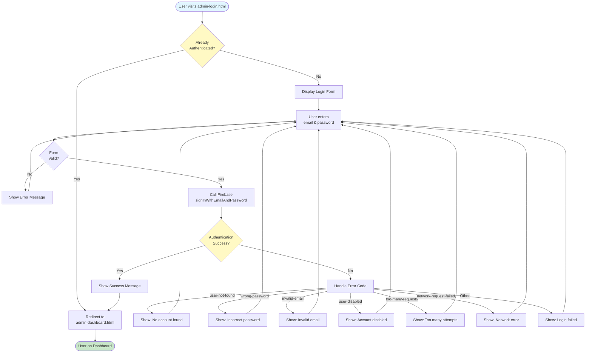

# Admin Login Workflow

## Overview
Authentication workflow for admin panel access. This is the entry point for all admin operations.

## Status
✅ **Fully Implemented**

## Workflow Diagram

## Integration Points

### Firebase Services
- **Firebase Authentication**: Email/password authentication
- **Firebase Config**: `admin/js/firebase-config.js`

### Data Flow
1. Page loads → Check existing auth state
2. If authenticated → Redirect to dashboard
3. If not → Show login form
4. On submit → Authenticate via Firebase Auth
5. On success → Redirect to dashboard
6. On error → Display user-friendly error message

### Related Pages
- **admin-dashboard.html**: Redirect destination after successful login
- **admin-login.html**: Self (login page)

### Security
- All admin pages require authentication via `requireAuth()` helper
- Failed login attempts are handled gracefully
- Network errors are caught and displayed

## Files
- `admin-login.html`: Login page UI and logic
- `admin/js/firebase-config.js`: Firebase initialization and auth helpers

