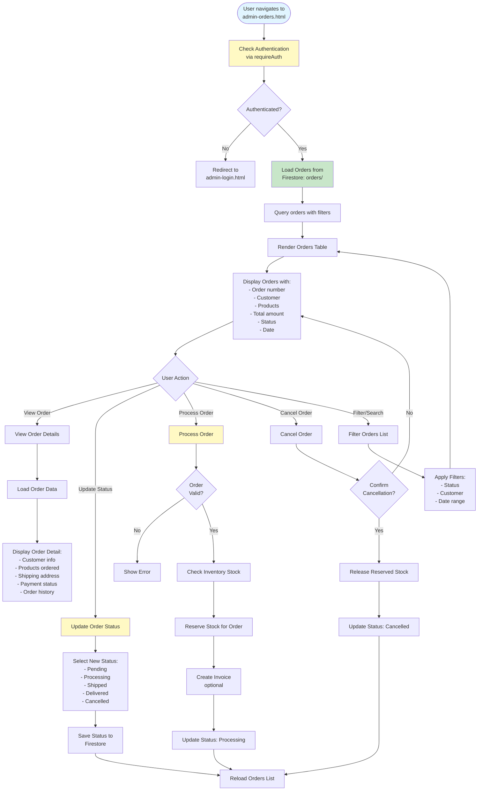

# Admin Orders Workflow

## Overview
Order management for customer orders from the shop. This page is a placeholder with basic structure.

## Status
🚧 **Planned - Coming Soon**

## Planned Workflow Diagram

## Planned Features

### Order Management
- **Order Viewing**: View customer orders
- **Order Status**: Track order status (pending, processing, shipped, delivered, cancelled)
- **Order Processing**: Process orders and reserve stock
- **Order Cancellation**: Cancel orders and release stock

### Integration Points

#### Firestore Collections
- **`orders/{orderId}`**: Order documents
  - Fields: `orderNumber`, `customerId`, `products[]`, `total`, `status`, `shippingAddress`, `paymentStatus`, `createdAt`, `updatedAt`

#### Cross-Module Integration
- **Shop → Orders**: Orders created from shop
- **Orders → Inventory**: Reserve/use stock for orders
- **Orders → Invoices**: Create invoice from order
- **Orders → Customers**: Link orders to customers

### Related Pages
- **shop.html**: Source for orders
- **admin-inventory.html**: Stock management for orders
- **admin-invoices.html**: Invoice creation from orders
- **admin-customers.html**: Customer order history

## Implementation Notes
- Order creation from shop cart
- Stock reservation for orders
- Order status workflow
- Order cancellation handling
- Integration with payment processing (future)

