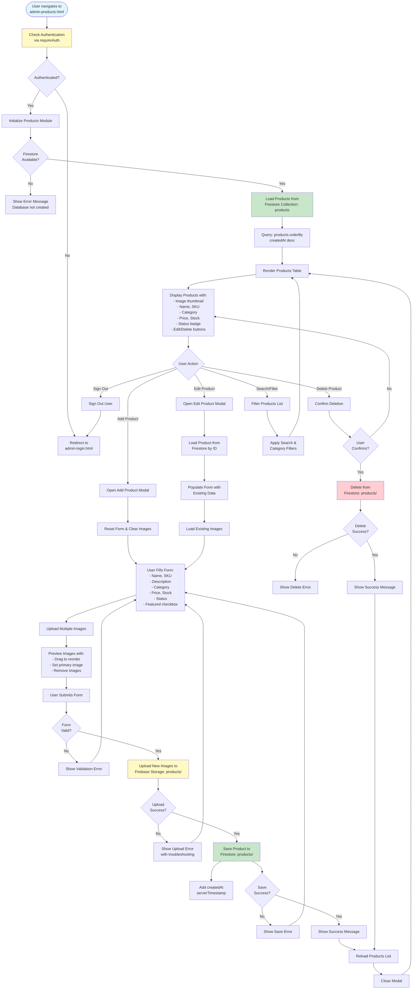

# Admin Products Workflow

## Overview
Complete CRUD operations for product management with multiple image upload support. This is the only fully functional admin module beyond login and dashboard.

## Status
✅ **Fully Implemented**

## Workflow Diagram

## Integration Points

### Firebase Services
- **Firestore**: `products` collection
  - Fields: `name`, `sku`, `description`, `category`, `price`, `stock`, `status`, `featured`, `images[]`, `createdAt`, `updatedAt`
- **Firebase Storage**: `products/{productId}/` path for images
  - Image metadata stored in Firestore: `url`, `order`, `isPrimary`
- **Firebase Authentication**: Required for all operations

### Data Operations

#### Create Product
1. User fills form and uploads images
2. Images uploaded to Storage: `products/{timestamp}_{filename}`
3. Product document created in Firestore with image URLs
4. `createdAt` set via `serverTimestamp()`

#### Update Product
1. Load existing product data
2. User modifies form and/or adds new images
3. New images uploaded to Storage: `products/{productId}_{timestamp}_{filename}`
4. Existing images preserved (not re-uploaded)
5. Product document updated in Firestore
6. `updatedAt` set via `serverTimestamp()`

#### Delete Product
1. User confirms deletion
2. Product document deleted from Firestore
3. **Note**: Images in Storage are NOT automatically deleted (manual cleanup required)

#### Read Products
1. Query all products ordered by `createdAt` descending
2. Display in table with filtering/search capabilities
3. Filter by category and search by name/description

### Storage Paths
- **Product Images**: `products/{productId}_{timestamp}_{filename}` or `products/{timestamp}_{filename}` for new products

### Frontend Integration
- Products displayed on `shop.html` (public-facing)
- Products filtered by `status: 'active'` for public display
- Featured products highlighted

### Related Pages
- **shop.html**: Public product display (reads from same Firestore collection)

## Files
- `admin-products.html`: Product management UI
- `admin/js/products.js`: Product CRUD logic, image upload, Firestore operations
- `admin/js/firebase-config.js`: Firebase initialization

## Known Limitations
- Image deletion from Storage not implemented when product deleted
- No batch operations
- No product variants/options support

