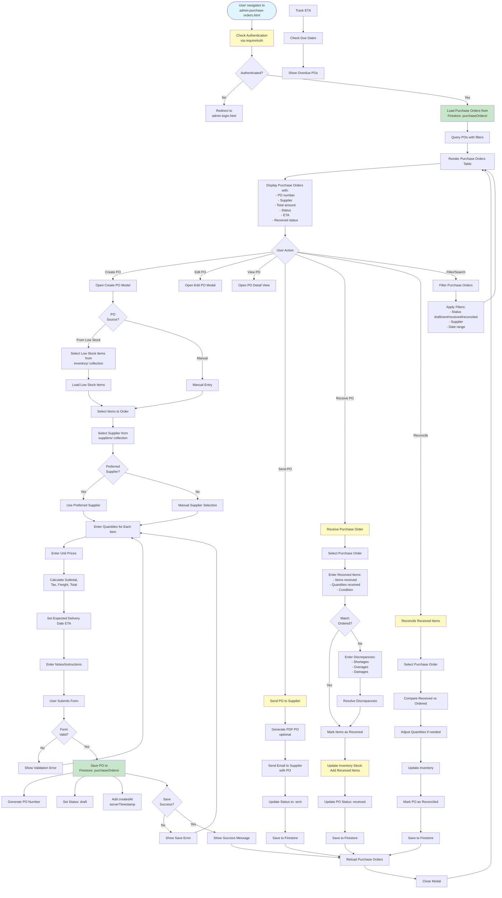

# Admin Purchase Orders Workflow

## Overview
Purchase order creation from low stock, receiving, reconciliation, ETA tracking, and freight cost tracking.

## Status
🚧 **Planned - Coming Soon**

## Planned Workflow Diagram

## Planned Features

### Purchase Order Creation
- **From Low Stock**: Auto-create PO from low stock items
- **Manual Entry**: Manual PO creation
- **Supplier Selection**: Select supplier (preferred or manual)
- **Line Items**: Items, quantities, unit prices
- **Calculations**: Subtotal, tax, freight, total
- **ETA Tracking**: Expected delivery date

### Purchase Order Status
1. **draft** → Being created
2. **sent** → Sent to supplier
3. **received** → Items received
4. **reconciled** → Received items reconciled with inventory
5. **cancelled** → PO cancelled

### Receiving Process
- **Receive Items**: Record received items and quantities
- **Discrepancy Handling**: Handle shortages, overages, damages
- **Inventory Update**: Update inventory when items received
- **Reconciliation**: Reconcile received vs ordered

### Integration Points

#### Firestore Collections
- **`purchaseOrders/{poId}`**: Purchase order documents
  - Fields: `poNumber`, `supplierId`, `status`, `lineItems[]`, `subtotal`, `tax`, `freight`, `total`, `eta`, `receivedDate`, `createdAt`, `updatedAt`
- **`purchaseOrders/{poId}/items/{itemId}`**: PO line items subcollection
- **`purchaseOrders/{poId}/receipts/{receiptId}`**: Receiving records subcollection

#### Storage Paths
- **PO PDFs**: `purchaseOrders/{poId}/po_{poNumber}.pdf` (optional)

#### Cross-Module Integration
- **Inventory → Purchase Orders**: Create PO from low stock
- **Suppliers → Purchase Orders**: Link PO to supplier
- **Purchase Orders → Inventory**: Update inventory when received
- **Categories → Purchase Orders**: Use preferred supplier

### Related Pages
- **admin-inventory.html**: Source for low stock items
- **admin-suppliers.html**: Supplier selection
- **admin-reports.html**: PO analysis and reporting

## Implementation Notes
- Automatic PO creation from low stock alerts
- Preferred supplier auto-selection
- ETA tracking and overdue alerts
- Receiving workflow with discrepancy handling
- Inventory update on receipt
- PO PDF generation (optional)
- Email sending to suppliers (optional)

