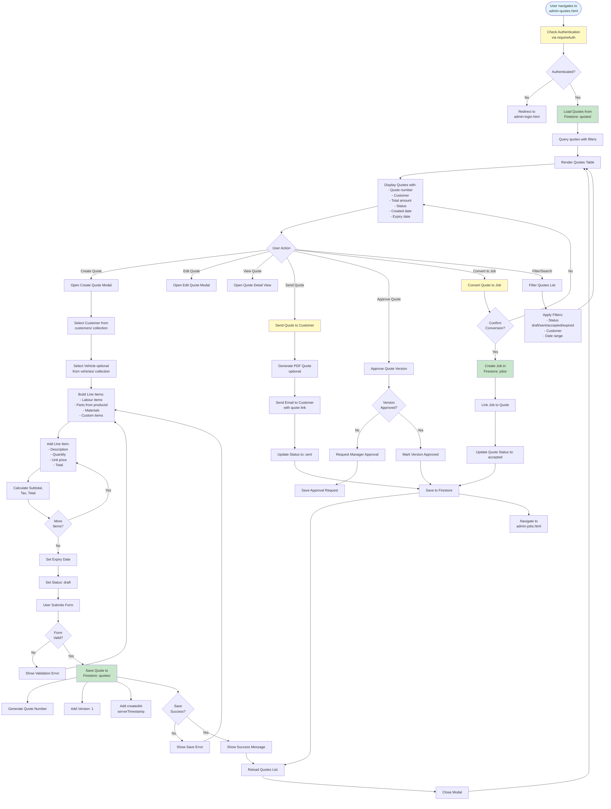

# Admin Quotes Workflow

## Overview
Quote builder with line items for labour, parts, and materials. Supports versioning, approvals, and conversion to jobs.

## Status
🚧 **Planned - Coming Soon**

## Planned Workflow Diagram

## Planned Features

### Quote Builder
- **Line Items**: Labour, parts (from products), materials, custom items
- **Pricing**: Quantity × unit price = line total
- **Calculations**: Subtotal, tax, total
- **Customer Selection**: Link to customer and vehicle
- **Quote Number**: Auto-generated sequential number

### Quote Statuses
1. **draft** → Being created, not sent
2. **sent** → Sent to customer
3. **accepted** → Customer accepted, converted to job
4. **expired** → Past expiry date
5. **declined** → Customer declined

### Quote Versioning
- **Version History**: Track multiple versions of same quote
- **Approvals**: Manager approval for quote versions
- **Change Tracking**: Track what changed between versions

### Integration Points

#### Firestore Collections
- **`quotes/{quoteId}`**: Main quote documents
  - Fields: `quoteNumber`, `customerId`, `vehicleId`, `status`, `lineItems[]`, `subtotal`, `tax`, `total`, `expiryDate`, `version`, `createdAt`, `updatedAt`
- **`quotes/{quoteId}/items/{itemId}`**: Line items subcollection (alternative structure)
- **`quotes/{quoteId}/versions/{versionId}`**: Version history subcollection

#### Storage Paths
- **Quote PDFs**: `quotes/{quoteId}/quote_{quoteNumber}.pdf` (optional)

#### Cross-Module Integration
- **Leads → Quotes**: Convert lead to quote
- **Quotes → Jobs**: Convert accepted quote to job
- **Products → Quotes**: Add products as line items
- **Customers → Quotes**: Link quote to customer
- **Vehicles → Quotes**: Link quote to vehicle

### Related Pages
- **admin-leads.html**: Source for new quotes
- **admin-jobs.html**: Destination for converted quotes
- **admin-customers.html**: Customer selection
- **admin-vehicles.html**: Vehicle selection
- **admin-products.html**: Product selection for line items

## Implementation Notes
- Quote PDF generation (optional, could use Cloud Functions)
- Email sending (optional, could use Cloud Functions or third-party service)
- Expiry date checking (could use Cloud Functions scheduled job)
- Quote templates (future enhancement)

