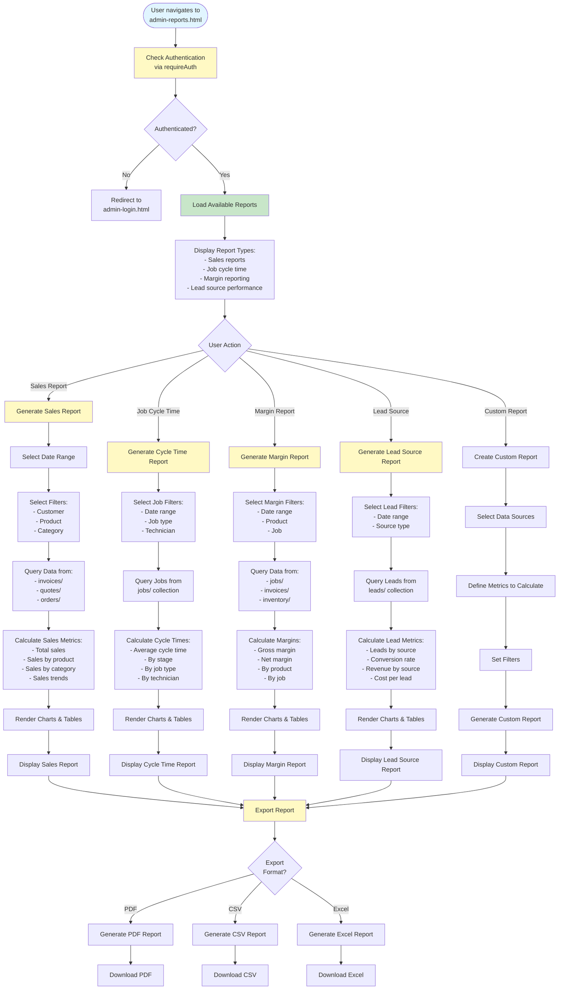

# Admin Reports Workflow

## Overview
Report generation for sales, job cycle time, margin reporting, and lead source performance.

## Status
🚧 **Planned - Coming Soon**

## Planned Workflow Diagram

## Planned Features

### Report Types
- **Sales Reports**: Total sales, sales by product/category, sales trends
- **Job Cycle Time**: Average cycle time, by stage, by job type, by technician
- **Margin Reporting**: Gross margin, net margin, by product, by job
- **Lead Source Performance**: Leads by source, conversion rate, revenue by source

### Report Features
- **Date Range Selection**: Filter reports by date range
- **Custom Filters**: Filter by customer, product, category, etc.
- **Charts & Tables**: Visual and tabular data presentation
- **Export Options**: PDF, CSV, Excel export
- **Scheduled Reports**: Schedule automatic report generation (future)

### Integration Points

#### Firestore Collections
- **Reports use data from**: `invoices/`, `quotes/`, `orders/`, `jobs/`, `leads/`, `inventory/`

#### Cross-Module Integration
- **All Modules → Reports**: Reports aggregate data from all modules
- **Reports → Analytics**: Report data for analytics

### Related Pages
- **admin-dashboard.html**: Quick report links
- **admin-events.html**: Event data for reports

## Implementation Notes
- Report generation performance (consider caching for large datasets)
- Chart library integration (Chart.js, D3.js, etc.)
- Export functionality (PDF generation, CSV/Excel export)
- Scheduled reports (Cloud Functions, future enhancement)
- Custom report builder (future enhancement)

