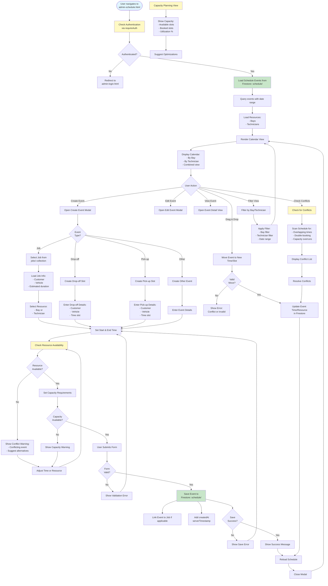

# Admin Schedule Workflow

## Overview
Calendar system by bay/technician with capacity planning, drop-off/pick-up slots, and conflict warnings.

## Status
🚧 **Planned - Coming Soon**

## Planned Workflow Diagram

## Planned Features

### Calendar Views
- **By Bay**: View schedule organized by work bays
- **By Technician**: View schedule organized by technician
- **Combined View**: See all resources in one calendar
- **Day/Week/Month Views**: Different time scale views

### Event Types
- **Job Events**: Scheduled work for jobs
- **Drop-off Slots**: Customer vehicle drop-off appointments
- **Pick-up Slots**: Customer vehicle pick-up appointments
- **Other Events**: Meetings, maintenance, etc.

### Capacity Planning
- **Resource Capacity**: Track capacity per bay/technician
- **Utilization Tracking**: Show utilization percentage
- **Conflict Detection**: Warn about overlapping bookings
- **Optimization Suggestions**: Suggest better scheduling

### Conflict Management
- **Overlap Detection**: Detect overlapping time slots
- **Double-booking Prevention**: Prevent same resource double-booking
- **Capacity Warnings**: Warn when capacity exceeded
- **Alternative Suggestions**: Suggest alternative times/resources

### Integration Points

#### Firestore Collections
- **`schedule/{eventId}`**: Schedule event documents
  - Fields: `type`, `jobId`, `customerId`, `vehicleId`, `resourceType` (bay/technician), `resourceId`, `startTime`, `endTime`, `duration`, `status`, `notes`, `createdAt`, `updatedAt`
- **`bays/{bayId}`**: Bay resource documents (if separate collection)
- **`technicians/{techId}`**: Technician resource documents (from users collection)

#### Cross-Module Integration
- **Jobs → Schedule**: Schedule job work in calendar
- **Schedule → Jobs**: Link scheduled events to jobs
- **Customers → Schedule**: Customer drop-off/pick-up slots
- **Vehicles → Schedule**: Vehicle-specific scheduling

### Related Pages
- **admin-jobs.html**: Source for job scheduling
- **admin-customers.html**: Customer drop-off/pick-up
- **admin-vehicles.html**: Vehicle-specific scheduling
- **admin-time.html**: Time tracking for scheduled work

## Implementation Notes
- Real-time conflict detection
- Drag-and-drop calendar interface (optional UI enhancement)
- Capacity planning algorithms
- Automated conflict resolution suggestions
- Calendar export (iCal format, optional)

