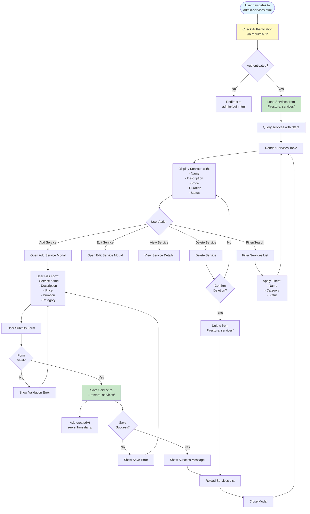

# Admin Services Workflow

## Overview
Service management for service offerings. This page is a placeholder with basic structure.

## Status
🚧 **Planned - Coming Soon**

## Planned Workflow Diagram

## Planned Features

### Service Management
- **Service Creation**: Create service offerings
- **Service Editing**: Edit service details
- **Service Deletion**: Delete services
- **Service Categories**: Organize services by category
- **Service Pricing**: Set service prices
- **Service Duration**: Set service duration

### Integration Points

#### Firestore Collections
- **`services/{serviceId}`**: Service documents
  - Fields: `name`, `description`, `price`, `duration`, `category`, `status`, `createdAt`, `updatedAt`

#### Cross-Module Integration
- **Services → Quotes**: Add services to quotes
- **Services → Jobs**: Link services to jobs
- **Services → Templates**: Service package templates
- **Services → Shop**: Display services on shop (optional)

### Related Pages
- **admin-quotes.html**: Add services to quotes
- **admin-jobs.html**: Link services to jobs
- **admin-templates.html**: Service package templates

## Implementation Notes
- Service CRUD operations
- Service category management
- Service pricing and duration tracking
- Integration with quotes and jobs

