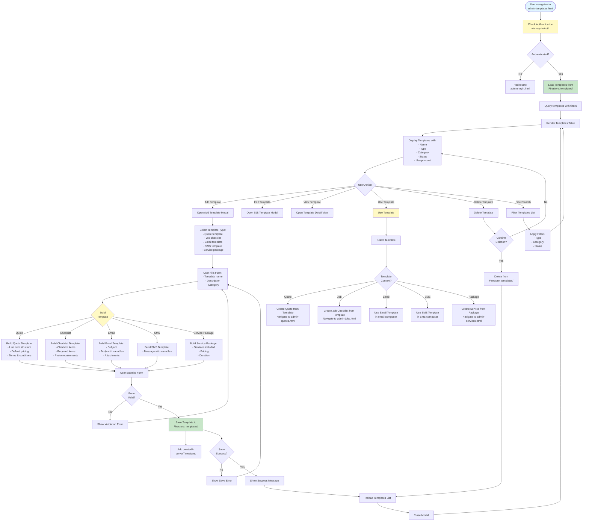

# Admin Templates Workflow

## Overview
Template management for quote templates, job checklist templates, email/SMS templates, and service packages.

## Status
🚧 **Planned - Coming Soon**

## Planned Workflow Diagram

## Planned Features

### Template Types
- **Quote Templates**: Pre-configured quote structures
- **Job Checklist Templates**: Reusable job checklists
- **Email Templates**: Email message templates with variables
- **SMS Templates**: SMS message templates with variables
- **Service Packages**: Pre-configured service packages

### Template Management
- **Template Creation**: Create templates for each type
- **Template Editing**: Edit existing templates
- **Template Usage**: Use templates when creating quotes/jobs/etc.
- **Template Categories**: Organize templates by category
- **Usage Tracking**: Track template usage count

### Template Variables
- **Variable Support**: Support variables in templates (e.g., {{customerName}})
- **Variable Replacement**: Replace variables with actual values
- **Variable Types**: Customer, job, quote, date, etc.

### Integration Points

#### Firestore Collections
- **`templates/{templateId}`**: Template documents
  - Fields: `name`, `type`, `category`, `content`, `variables[]`, `status`, `usageCount`, `createdAt`, `updatedAt`

#### Cross-Module Integration
- **Templates → Quotes**: Use quote templates
- **Templates → Jobs**: Use checklist templates
- **Templates → QA**: Use QA checklist templates
- **Templates → Communications**: Use email/SMS templates
- **Templates → Services**: Use service package templates

### Related Pages
- **admin-quotes.html**: Use quote templates
- **admin-jobs.html**: Use checklist templates
- **admin-qa.html**: Use QA checklist templates
- **admin-services.html**: Use service package templates

## Implementation Notes
- Template variable system
- Template usage tracking
- Template preview functionality
- Template versioning (future enhancement)
- Template sharing (future enhancement)

