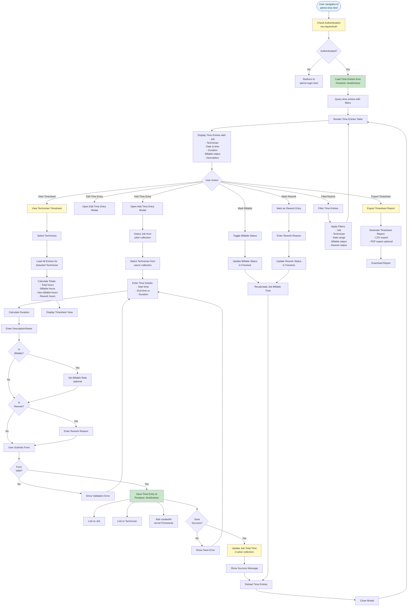

# Admin Time Tracking Workflow

## Overview
Time entries per job with billable vs non-billable tracking, tech timesheets, and rework tracking.

## Status
🚧 **Planned - Coming Soon**

## Planned Workflow Diagram

## Planned Features

### Time Entry
- **Job Linking**: Link time entry to specific job
- **Technician**: Track which technician worked
- **Time Tracking**: Start/end time or duration entry
- **Description**: Notes about work performed
- **Billable Status**: Mark as billable or non-billable
- **Billable Rate**: Set hourly rate for billable work
- **Rework Tracking**: Mark entries as rework with reason

### Timesheet Management
- **Technician Timesheets**: View all entries for a technician
- **Job Timesheets**: View all entries for a job
- **Totals Calculation**: Total hours, billable hours, rework hours
- **Date Range Filtering**: Filter by date range
- **Export**: Export timesheets as CSV/PDF

### Rework Tracking
- **Rework Identification**: Mark time entries as rework
- **Rework Reasons**: Track why rework was needed
- **Rework Analysis**: Analyze rework patterns and costs
- **Quality Metrics**: Use rework data for quality improvement

### Integration Points

#### Firestore Collections
- **`timeEntries/{entryId}`**: Time entry documents
  - Fields: `jobId`, `technicianId`, `startTime`, `endTime`, `duration`, `description`, `billable`, `billableRate`, `isRework`, `reworkReason`, `date`, `createdAt`, `updatedAt`
- **`jobs/{jobId}`**: Job documents (updated with total time)
  - Fields: `totalTime`, `billableTime`, `reworkTime`

#### Cross-Module Integration
- **Jobs → Time Tracking**: Track time spent on jobs
- **Time Tracking → Jobs**: Update job total time
- **Time Tracking → Invoices**: Use billable time for invoicing
- **Time Tracking → Reports**: Time analysis and reporting
- **Users → Time Tracking**: Technician timesheets

### Related Pages
- **admin-jobs.html**: Source for job selection
- **admin-reports.html**: Time analysis reports
- **admin-invoices.html**: Use billable time for invoicing
- **admin-users.html**: Technician selection

## Implementation Notes
- Automatic duration calculation from start/end time
- Real-time job time totals update
- Rework pattern analysis (future enhancement)
- Time entry validation (prevent overlapping entries, optional)
- Mobile time entry (future enhancement for technicians)

