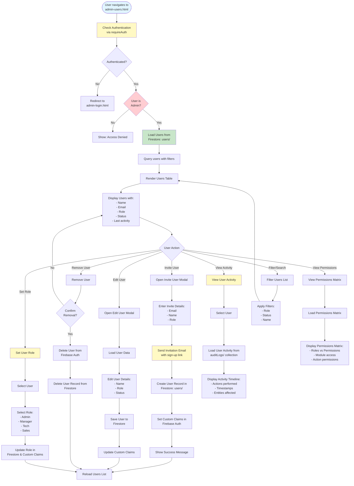

# Admin Users & Roles Workflow

## Overview
Role-based access control with user management, invite/remove staff, permissions matrix, and activity per user.

## Status
🚧 **Planned - Coming Soon**

## Planned Workflow Diagram

## Planned Features

### User Management
- **User Invitation**: Invite users via email
- **User Creation**: Create user accounts
- **User Editing**: Edit user details and roles
- **User Removal**: Remove users from system
- **User Status**: Active, inactive, suspended

### Role Management
- **Roles**: Admin, Manager, Tech, Sales
- **Custom Claims**: Set Firebase Auth custom claims
- **Role Assignment**: Assign roles to users
- **Role Permissions**: Define permissions per role

### Permissions Matrix
- **Module Access**: Control access to admin modules
- **Action Permissions**: Control create/read/update/delete permissions
- **Permission Display**: Visual permissions matrix

### Activity Tracking
- **User Activity**: Track user actions
- **Activity Timeline**: View user activity history
- **Activity Filtering**: Filter by date, action, entity

### Integration Points

#### Firebase Services
- **Firebase Authentication**: User accounts and custom claims
- **Firestore**: User records and activity logs

#### Firestore Collections
- **`users/{userId}`**: User profile documents
  - Fields: `name`, `email`, `role`, `status`, `invitedAt`, `lastActivity`, `createdAt`, `updatedAt`
- **`auditLogs/{logId}`**: Activity logs (user activity)

#### Cross-Module Integration
- **All Modules → Users**: Role-based access control
- **Users → Audit Log**: Track user activity

### Related Pages
- **admin-audit.html**: User activity in audit log
- **All Admin Pages**: Role-based access enforcement

## Implementation Notes
- Firebase Auth custom claims for roles
- Email invitation system (Cloud Functions or third-party)
- Permission matrix definition and enforcement
- User activity tracking
- Role-based UI rendering (show/hide features based on role)

